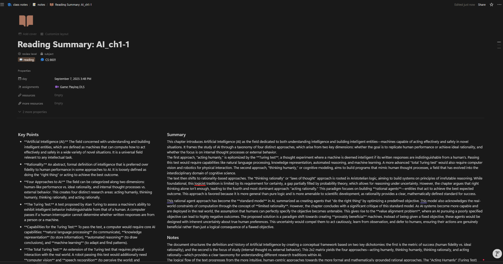
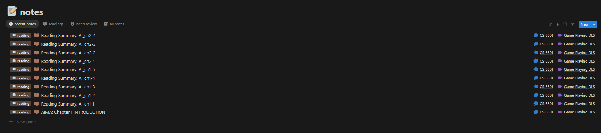

# Notion Personal Reading Notes Tracker

A Python tool designed to automate the process of summarizing PDF documents using the Gemini AI model and pushing the processed content, including key points, notes, summary, and the original content, to Notion. This helps in organizing and tracking personal reading notes efficiently. Allow bulk process for multiple pdf, prefer to chunk down large pdf into chapters for better AI summary accuracy.

## Public notion demo
[Class notes](https://www.notion.so/Public-class-notes-27855a34994980b9866dee8f5eb51ee5?source=copy_link)

## Features

*   **PDF Content Extraction**: Extracts text from PDF files located in a specified directory.
*   **AI-Powered Summarization (with DSPy)**: Leverages the [DSPy framework](https://dspy.ai/) to program and optimize prompts for the Gemini AI model, generating high-quality key points, detailed notes, and comprehensive summaries of the extracted text. DSPy enables the creation of modular AI systems and automatically optimizes prompts and weights for various NLP tasks, enhancing the reliability and accuracy of AI-driven content generation. This approach significantly improves the robustness and performance of the AI by systematically compiling and optimizing the prompt engineering process.
*   **Data Validation with Pydantic**: Utilizes [Pydantic](https://docs.pydantic.dev/) for robust data validation and settings management. Pydantic ensures that all configuration and data models are type-safe and validated at runtime, reducing errors and improving the reliability of data processing throughout the application. This is crucial for maintaining data integrity when interacting with external APIs like Notion and Gemini.
*   **Notion Integration**: Creates new pages in a specified Notion database with the processed reading notes, including structured content (key points as bulleted lists, summary and notes as paragraphs, and original content with proper headings).
*   **Configurable**: Allows configuration of Notion database IDs and reading folder via a `config.yaml` file.
*   **Logging**: Provides detailed logging for tracking the process and troubleshooting. Log files are generated in the `logging/app.log` file.

## Installation

1.  **Clone the repository**:
    ```bash
    git clone https://github.com/TIMHX/personal_notion_reading_note.git
    cd personal_notion_reading_note
    ```

2.  **Install uv (if not already installed)**:
    If you don't have `uv` installed, you can install it using `pip`:
    ```bash
    pip install uv
    ```

3.  **Create and activate a virtual environment**:
    Using `uv`, create a virtual environment and activate it. This ensures all dependencies are isolated from your system's Python environment.
    ```bash
    uv venv
    source .venv/bin/activate  # On macOS/Linux
    .venv\Scripts\activate     # On Windows
    ```

3.  **Install dependencies**:
    With the virtual environment active, install the project dependencies listed in `pyproject.toml`.
    ```bash
    uv sync --active
    ```

## Configuration

The project uses a `.env` file for sensitive API keys and a `config.yaml` file for general settings. Pydantic is used to manage and validate these configurations, ensuring type safety and robust error handling.

1.  **Environment Variables (`.env`)**: Create a `.env` file in the root directory and add the following:
    ```
    NOTION_API_KEY="your_notion_api_key"
    NOTION_DATABASE_ID="your_notion_database_id"
    GEMINI_API_KEY="your_gemini_api_key"
    LOG_LEVEL="WARNING" # Optional: Set to INFO, DEBUG, WARNING, ERROR, CRITICAL
    ```
    *   `NOTION_API_KEY`: Obtain this from your Notion integration settings.
    *   `NOTION_DATABASE_ID`: The ID of the Notion database where reading notes will be stored.
    *   `GEMINI_API_KEY`: Your API key for the Google Gemini AI model.
    *   `LOG_LEVEL`: (Optional) Set the logging level. Default is `WARNING`.

2.  **Configuration File (`config.yaml`)**: Create a `config.yaml` file in the root directory with the following structure:
    ```yaml
    reading_folder: "readings"
    max_tokens: 8000
    model: "gemini/gemini-2.5-pro"
    subject_id: "your_notion_subject_relation_id"
    assignments_id: "your_notion_assignments_relation_id"
    ```
    *   `reading_folder`: The directory where your PDF files are located (e.g., `readings/`).
    *   `max_tokens`: Maximum number of tokens for the AI model's response.
    *   `model`: The specific Gemini AI model to use (e.g., `gemini/gemini-2.5-pro`).
    *   `subject_id`: The Notion relation ID for the 'subject' property in your database.
    *   `assignments_id`: The Notion relation ID for the 'assignments' property in your database.
    *   ~~`reading_template_id`: (Optional) The ID of a Notion template to use when creating new reading pages.~~
    *   ~~`prompts`: A list of prompt configurations for the Gemini AI. Each prompt has a `name` and `content`.~~
    *   ~~`active_prompt`: The name of the prompt to be used for processing documents. This should match one of the `name` values in the `prompts` list.~~

## Usage

1.  Place your PDF documents in the directory specified by `reading_folder` in `config.yaml` (e.g., `./readings/`). For demonstration purposes, `readings/AI_ch1-1.pdf` will be used as an example.
2.  Run the main script:
    Ensure your virtual environment is activated (as per installation step 2). Then, run the main script:
    ```bash
    python src/main.py
    ```
    The script will:
    *   Read all PDF files from the `reading_folder`.
    *   Process each PDF using the configured Gemini AI model and the active DSPy prompt to extract key points, notes, and a summary.
    *   Create a new page in your specified Notion database for each PDF, populating it with the extracted information and the original content.

## Output example (Notion)



## Project Structure

```
.
├── .env                  # Environment variables (API keys)
├── .gitignore            # Git ignore file
├── config.yaml           # Configuration for reading folder and Notion IDs
├── pyproject.toml        # Project metadata and dependencies
├── README.md             # This README file
├── uv.lock               # Dependency lock file
└── src/
    ├── __init__.py
    ├── dspy_modules.py   # DSPy modules for prompt programming and AI model optimization
    ├── gemini_processor.py   # Handles interaction with Gemini AI for summarization
    ├── logger_utils.py       # Utility for logging
    ├── main.py               # Main script to orchestrate PDF processing and Notion integration
    └── notion_client.py      # Handles interaction with Notion API for page creation
```

## Usage of MCPs (Model Context Protocol) during Development

This project leverages the Model Context Protocol (MCP) for enhanced development and interaction with external services. Specifically, it integrates with:

*   **Notion MCP**: Used for direct interaction with the Notion API, allowing for programmatic creation and management of Notion pages and databases. This is crucial for the core functionality of pushing reading notes to Notion.
*   **Context7**: Utilized for retrieving up-to-date documentation and code examples for various libraries. This aids in understanding and implementing features by providing relevant context during development.
*   **Gemini AI Model**: The Gemini AI model is used for summarizing PDF content, extracting key points, and generating detailed notes. The specific model (e.g., `gemini/gemini-2.5-pro`) is configurable via `config.yaml`. During development, different Gemini models can be used for more advanced summarization and content generation tasks.

## Notion API Usage in `src/notion_client.py`

The `src/notion_client.py` file is responsible for all interactions with the Notion API. It uses the `requests` library to make HTTP requests to the Notion API endpoints.

Key functionalities and API endpoints used:

*   **Initialization (`__init__`)**:
    *   Stores the Notion API key, database ID, and an optional reading template ID.
    *   Sets up `Authorization` headers with the API key and `Notion-Version` to `2022-06-28`.
    *   Initializes a logger for tracking API interactions.

*   **Creating a Reading Page (`create_reading_page`)**:
    *   **Endpoint**: `POST https://api.notion.com/v1/pages`
    *   **Purpose**: Creates a new page in the specified Notion database.
    *   **Payload**:
        *   `parent`: Specifies the `database_id` where the page will be created.
        *   `icon`: Sets an external SVG icon (e.g., `https://www.notion.so/icons/book_open_brown.svg`) for the new page. For more details on Notion page icons via API, refer to this [Reddit post](https://www.reddit.com/r/Notion/comments/10mld67/notion_page_icons_through_api/).
        *   `properties`: Defines the page's properties, including:
            *   `notes`: The title of the page.
            *   `review level`: A select property set to "📖 reading".
            *   `day`: The creation date of the page.
            *   `subject` and `assignments`: Relation properties linked by their IDs.
        *   `children`: An array of block objects that form the content of the page. This includes:
            *   A `column_list` block containing two `column` blocks for "Key Points" and "Summary and Notes".
            *   `heading_3` blocks for "Key Points", "Summary", and "Notes".
            *   `bulleted_list_item` blocks for individual key points.
            *   `paragraph` blocks for summary and notes content.
            *   A `heading_2` block for "Original Content".
            *   Dynamically created `heading_1`, `heading_2`, `heading_3`, and `paragraph` blocks for the original PDF content, handling chunking for large paragraphs.
    *   **Error Handling**: Logs errors and Notion API responses for debugging.

*   **Creating Heading Blocks (`_create_heading_block`)**:
    *   A helper method to construct Notion heading blocks (h1, h2, h3) with rich text content.

This client abstracts the complexities of the Notion API, providing a clean interface for the main application to create and populate Notion pages with structured reading notes.

```
.
├── .env                  # Environment variables (API keys)
├── .gitignore            # Git ignore file
├── config.yaml           # Configuration for reading folder and Notion IDs
├── pyproject.toml        # Project metadata and dependencies
├── README.md             # This README file
├── uv.lock               # Dependency lock file
└── src/
    ├── __init__.py
    ├── gemini_processor.py   # Handles interaction with Gemini AI for summarization
    ├── logger_utils.py       # Utility for logging
    ├── main.py               # Main script to orchestrate PDF processing and Notion integration
    └── notion_client.py      # Handles interaction with Notion API for page creation
